# xa-cdk


## Description

This library contains resources that can be configured to be accessible across AWS accounts.  
By default, CDK can't update the resource policies of resources in another account, so when  
setting up cross-account access between resources, some manual configuration is required.  

BUT NO MORE.  
No more shall developers be forced to click through dashboard menus (or type CLI commands,  
tedious in its own right) to simply access their S3 buckets (et al) from another account!  
FREEDOM!!  

## Installation

Run:  
`npm install @doceight/xa-cdk`

## Usage

Given accessed AWS account with ID: `000000000000`  
and accessor AWS account with ID: `111111111111`,  
you can automate IAM policy management across AWS accounts/CDK stacks using the following  
pattern:  

1. In `000000000000`: Deploy the resource(s) to be accessed

```typescript
const key = new xa.CrossAccountKmsKey(this, "xaKey", {
  xaAwsIds: ["111111111111"], // AWS account IDs that need access
});

new xa.CrossAccountS3Bucket(this, "XaBucket", {
  bucketName: "xa-bucket",
  xaAwsIds: ["111111111111"], // AWS account IDs that need access
  encryptionKey: key.key,
});
```

2. In `111111111111`: Register the resources that need access

```typescript
// Import the resources to be accessed
const xaBucket = s3.Bucket.fromBucketName(
  this,
  "XaBucket",
  "xa-bucket",
);
const xaKey = kms.Key.fromKeyArn(
  this,
  "XaKey",
  "arn:aws:kms:ap-northeast-1:000000000000:key/00000000-0000-4000-000-000000000000",
);

// Make the distribution itself
this.distribution = new cloudfront.Distribution(this, "Distribution", {
  defaultBehavior: {
    origin: origins.S3BucketOrigin.withOriginAccessControl(xaBucket),
  },
});

// Register the Cloudfront distribution with the S3 Bucket and KMS key here
xa.CrossAccountS3BucketManager.allowCloudfront({
  scope: this,
  bucketName: xaBucket.bucketName,
  distributionId: this.distribution.distributionId,
});
xa.CrossAccountKmsKeyManager.allowCloudfront({
  scope: this,
  keyId: xaKey.keyId,
  distributionId: this.distribution.distributionId,
});
```

3. In `111111111111`: After all accessors have been registered, create a cross-account resource manager for each resource in the other account

```typescript
...

// Create resource managers to update policies on the resources in the other account
new xa.CrossAccountS3BucketManager(this, "XaBucketMgmt", {
  xaBucketName: "xa-bucket",
  xaAwsId: "000000000000", // AWS account ID of the S3 Bucket
});
new xa.CrossAccountKmsKeyManager(this, "XaKeyMgmt", {
  xaKeyId: "00000000-0000-4000-000-000000000000",
  xaAwsId: "000000000000", // AWS account ID of the KMS Key
});

```

**Note:** Attempting to register new accessors after this step will result in an error.

## API Reference

(v1.0.0)

- Managed S3 Bucket:
```typescript
CrossAccountS3Bucket(scope: Construct, id: string, {
  xaAwsIds: string[],
  ...s3.BucketProps
})
```
- Managed KMS key:
```typescript
CrossAccountKmsKey(scope: Construct, id: string, {
  xaAwsIds: string[],
  ...kms.KeyProps
})
```
- S3 Bucket Manager:
```typescript
CrossAccountS3BucketManager(scope: Construct, id: string, {
  xaBucketName: string,
  xaAwsId: string,
  managerTimeout?: number = 30,
  callerTimeout?: number = 30
})
```
  - Register Cloudfront distribution:
  ```typescript
  static allowCloudfront({
    scope: Construct,
    distributionId: string,
    bucketName: string,
    actions?: string[] = ["s3:GetObject"]
  })
  ```
- KMS Key Manager:
```typescript
CrossAccountKmsKeyManager(scope: Construct, id: string, {
  xaKeyId: string,
  xaAwsId: string,
  managerTimeout?: number = 30,
  callerTimeout?: number = 30
})
```
  - Register Cloudfront distribution:
  ```typescript
  static allowCloudfront({
    scope: Construct,
    distributionId: string,
    keyId: string,
    actions?: string[] = [
      "kms:Decrypt",
      "kms:Encrypt",
      "kms:GenerateDataKey*",
      "kms:DescribeKey"
    ]
  })
  ```

## Diagram

```mermaid

architecture-beta
    group accessor(logos:aws-cloud)[Accessor]
    service cf(logos:aws-cloudfront)[CloudFront] in accessor
    service s3-mgmt(logos:aws-lambda)[S3 Updater] in accessor
    service kms-mgmt(logos:aws-lambda)[KMS Updater] in accessor
    junction to-mgmt in accessor

    junction from-s3mgmt
    junction from-kmsmgmt

    group accessed(logos:aws-cloud)[Accessed]
    group s3(logos:aws-s3)[S3] in accessed
    service bucket(logos:aws-s3)[Bucket] in s3
    service bucket-role(logos:aws-iam)[Bucket Updater Role] in s3
    %% group ssm(logos:aws-systems-manager)[SSM Advanced tier] in accessed
    service s3ssm(logos:aws-systems-manager)[S3 Accessors] in s3
    group kms(logos:aws-kms)[KMS] in accessed
    service key(logos:aws-kms)[Key] in kms
    service key-role(logos:aws-iam)[Key Updater Role] in kms
    service kmsssm(logos:aws-systems-manager)[KMS Accessors] in kms

    cf:R -[on update]- L:to-mgmt

    to-mgmt:T -- B:s3-mgmt
    to-mgmt:B -- T:kms-mgmt

    s3-mgmt:R -- L:from-s3mgmt
    from-s3mgmt:R-[assume role]- L:bucket-role
    bucket-role:R -[update policy]-> L:bucket
    s3ssm:L -[policy information]- R:bucket
    from-s3mgmt:R -[store accessor info]-> L:s3ssm

    kms-mgmt:R -- L:from-kmsmgmt
    from-kmsmgmt:R -[update policy]- L:key-role
    key-role:R -[update policy]-> L:key
    kmsssm:L -[policy information]- R:key
    from-kmsmgmt:R -[store accessor info]-> L:kmsssm
    
    key:T -[encryption]- B:bucket

```



(One of these days GitHub will support logos:aws-icons in its inline Mermaid diagrams, thus  
I'm using them now.)  

## License

This project is licensed under the MIT License - see the [LICENSE](LICENSE) file for details.
