# cross-account resources

This library contains resources that can be configured to be accessible across AWS accounts.
By default, CDK can't update the resource policies of resources in another account, so when
setting up cross-account access between resources, some manual configuration is required.

BUT NO MORE.
No more shall developers be forced to click through dashboard menus (or type CLI commands,
tedious in its own right) to simply access their S3 buckets (et al) from another account!
FREEDOM!!

# Diagram

```mermaid

architecture-beta
    group accessor(logos:aws-cloud)[Accessor]
    service cf(logos:aws-cloudfront)[CloudFront] in accessor
    service s3-mgmt(logos:aws-lambda)[S3 Updater] in accessor
    service kms-mgmt(logos:aws-lambda)[KMS Updater] in accessor
    junction to-mgmt in accessor

    group accessed(logos:aws-cloud)[Accessed]
    group s3(logos:aws-s3)[S3] in accessed
    service bucket(logos:aws-s3)[Bucket] in s3
    service bucket-role(logos:aws-iam)[Bucket Updater Role] in s3
    group kms(logos:aws-kms)[KMS] in accessed
    service key(logos:aws-kms)[Key] in kms
    service key-role(logos:aws-iam)[Key Updater Role] in kms

    cf:R -[on update]- L:to-mgmt

    to-mgmt:T -- B:s3-mgmt
    to-mgmt:B -- T:kms-mgmt

    s3-mgmt:R -[assume role]- L:bucket-role
    bucket-role:R -[assume role]-> L:bucket

    kms-mgmt:R -[update policy]- L:key-role
    key-role:R -[update policy]-> L:key

    key:T -[encryption]- B:bucket

```

(One of these days GitHub will support logos:aws-icons in its inline Mermaid diagrams, thus
I'm using them now.
If they still aren't rendering properly by the time you read this, here's a link to a prerendered
.svg diagram as well.)
